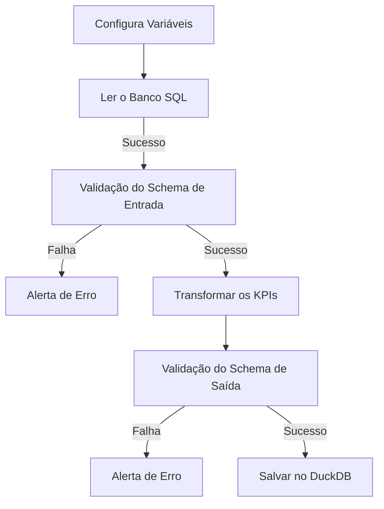

# Documentação - Data Quality

## Contrato de dados

::: app.schemas.ProdutoSchema

## Ler o Banco

::: app.elt.extrair_do_sql

## Transformar os KPIs

::: app.etl.transformar

## Salvar no DuckDB

::: app.etl.load_to_duckdb
